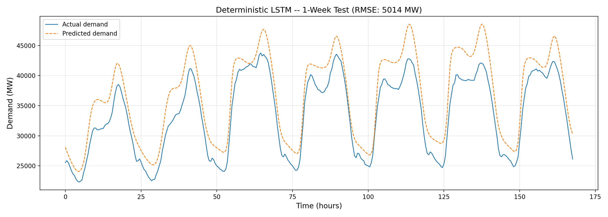
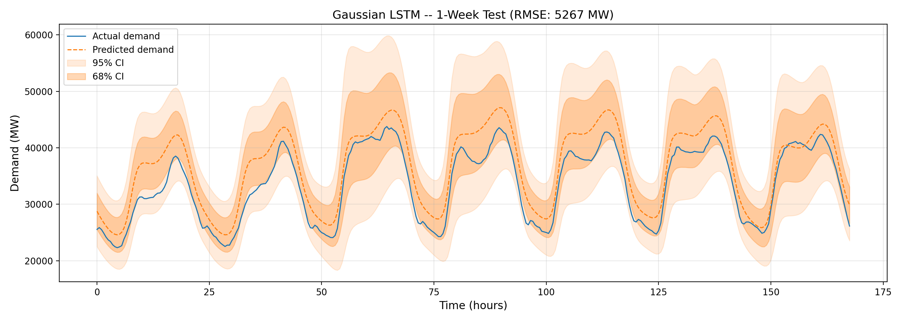
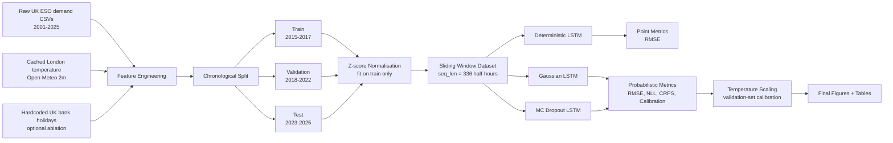
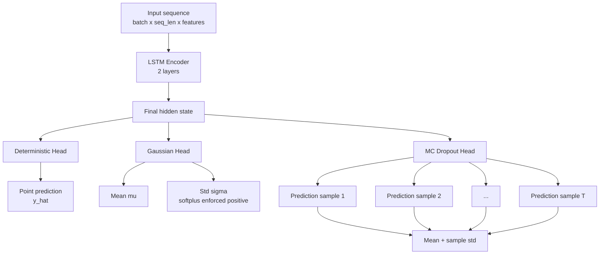
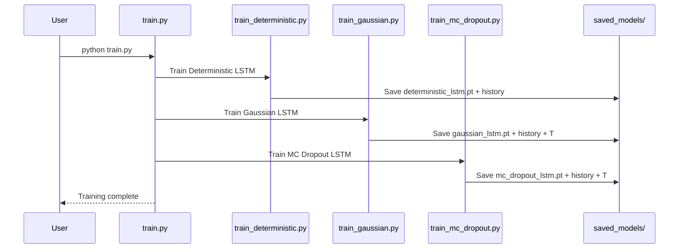
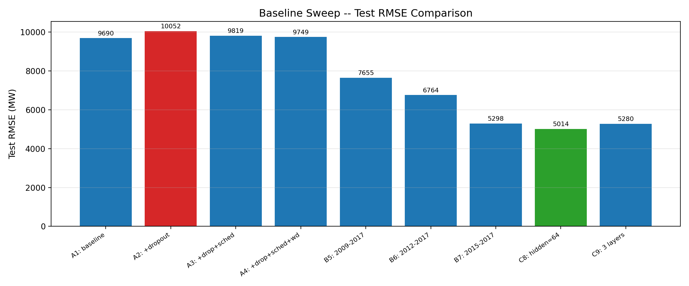
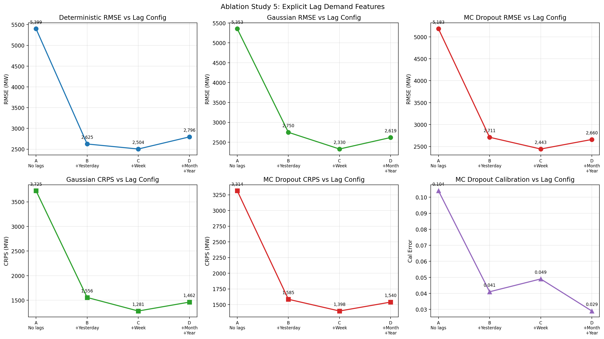
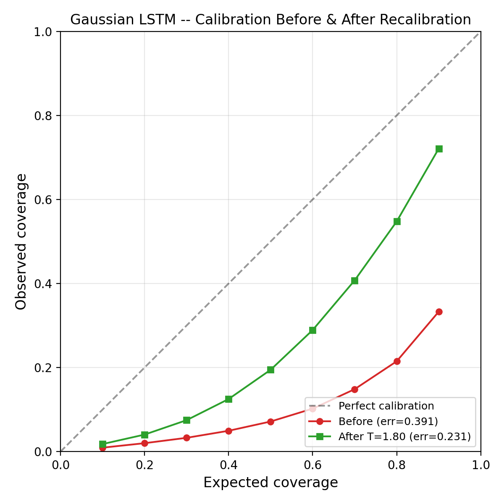
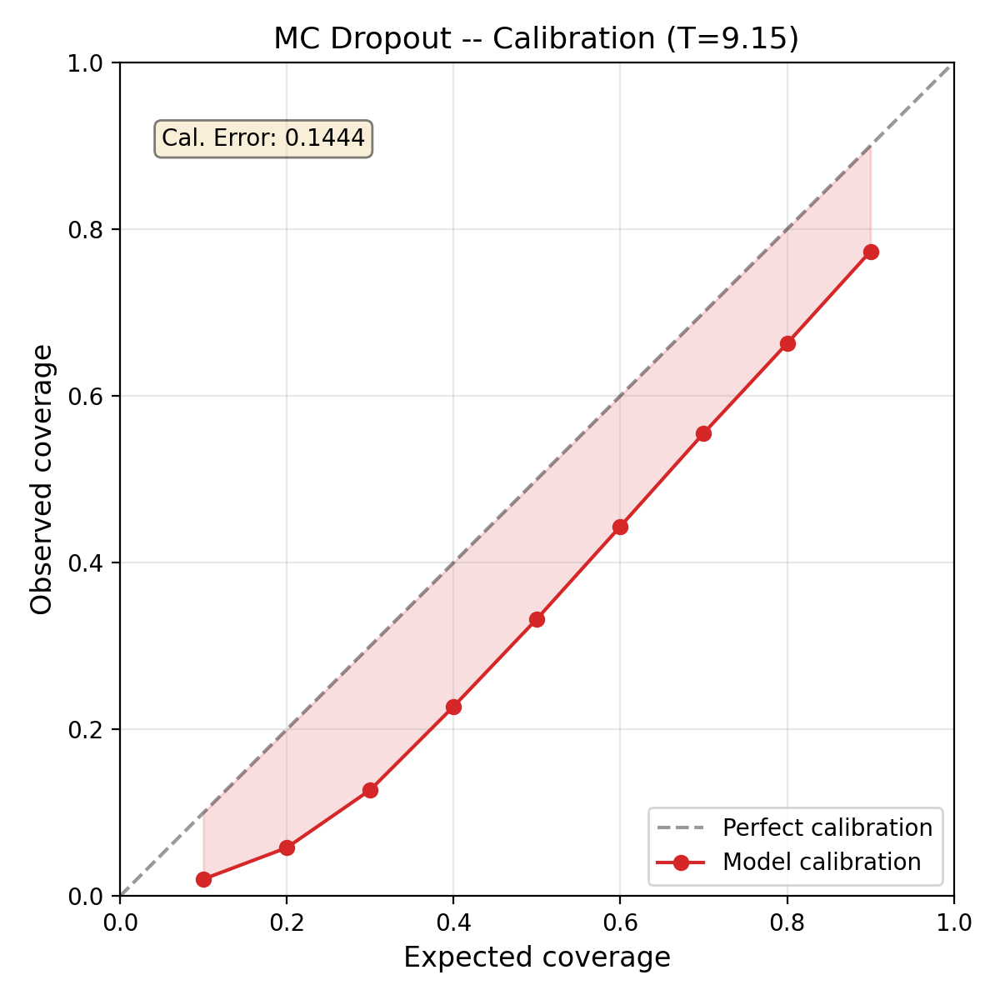
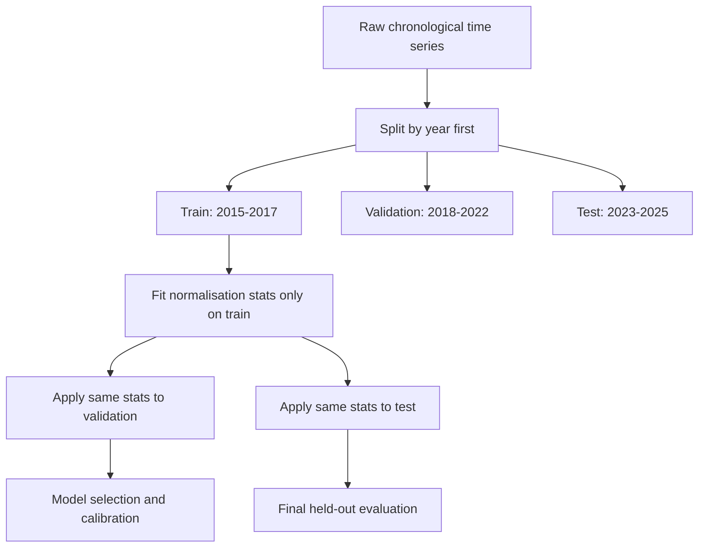

# Probabilistic UK Electricity Demand Forecasting

<p align="center">
  
  
</p>

<p align="center">
  <strong>LSTM-based electricity demand forecasting with uncertainty quantification, calibration, and ablation analysis.</strong>
</p>

<p align="center">
  
  
  
  
  
</p>

---

## Table of Contents

* [Overview](#overview)
* [What This Project Does](#what-this-project-does)
* [Forecasting Pipeline](#forecasting-pipeline)
* [Model Architecture](#model-architecture)
* [Repository Structure](#repository-structure)
* [Setup](#setup)
* [Quick Start](#quick-start)
* [Results](#results)
* [Ablation Studies](#ablation-studies)
* [Figures](#figures)
* [Data and Features](#data-and-features)
* [Reproducibility Notes](#reproducibility-notes)
* [Limitations](#limitations)
* [GenAI Declaration](#genai-declaration)

---

## Overview

This repository implements a **probabilistic UK electricity demand forecasting system** using LSTM models. The project predicts future National Demand (`ND`) from half-hourly UK electricity demand data and engineered temporal/weather features.

Unlike a basic point-forecasting model, this project also estimates uncertainty. That makes the output more useful in real operational settings, where decision-makers need to know not only *what the forecast is*, but also *how reliable the forecast appears to be*.

The project compares three LSTM-based approaches:

| Model                  |                                Forecast Type |  Uncertainty Captured | Training Objective                |
| ---------------------- | -------------------------------------------: | --------------------: | --------------------------------- |
| **Deterministic LSTM** |                               Point forecast |                  None | Mean Squared Error                |
| **Gaussian LSTM**      |                    Mean + standard deviation | Aleatoric uncertainty | Gaussian Negative Log-Likelihood  |
| **MC Dropout LSTM**    | Distribution from repeated stochastic passes | Epistemic uncertainty | MSE + dropout active at inference |

---

## What This Project Does

The system performs the full forecasting workflow:

1. Loads UK electricity demand data from 2001–2025.
2. Engineers time-series features such as weekend flags and cyclical encodings.
3. Optionally merges cached London temperature data from Open-Meteo.
4. Builds sliding-window datasets for LSTM training.
5. Trains deterministic and probabilistic LSTM models.
6. Evaluates point accuracy and probabilistic quality.
7. Applies post-hoc temperature scaling to improve uncertainty calibration.
8. Runs ablation studies for temperature, sequence length, dropout, holidays, and lag features.
9. Saves publication-ready figures and JSON result files.

---

## Forecasting Pipeline



The project uses a strict **chronological split**. The data is never shuffled before splitting, which avoids time-series leakage.

---

## Model Architecture

All three models share the same LSTM encoder idea, but use different output heads.



### Model Outputs

| Model              | Output Dictionary                                                        | Main File                     |
| ------------------ | ------------------------------------------------------------------------ | ----------------------------- |
| Deterministic LSTM | `{"prediction": tensor}`                                                 | `src/models/deterministic.py` |
| Gaussian LSTM      | `{"mu": tensor, "sigma": tensor}`                                        | `src/models/gaussian.py`      |
| MC Dropout LSTM    | `{"prediction": tensor, "uncertainty": tensor}` after repeated inference | `src/models/mc_dropout.py`    |

---

## Repository Structure

```text
.
├── README.md
├── instruction.pdf
├── train.py                         # Runs all three training scripts
├── train_deterministic.py            # Deterministic LSTM training
├── train_gaussian.py                 # Gaussian LSTM training + evaluation
├── train_mc_dropout.py               # MC Dropout training + evaluation
├── test.py                           # Loads saved weights and regenerates metrics/figures
├── recalibrate_gaussian.py           # Re-fits Gaussian temperature scaling
├── configs/
│   └── default.yaml                  # Baseline configuration
├── src/
│   ├── data_loader.py                # Data loading, feature engineering, normalisation, DataLoaders
│   ├── EDA.py                        # Exploratory data analysis figures
│   ├── evaluate.py                   # RMSE, NLL, CRPS, calibration and plotting utilities
│   └── models/
│       ├── base_lstm.py              # Shared LSTM encoder
│       ├── deterministic.py          # Point-forecast LSTM
│       ├── gaussian.py               # Gaussian probabilistic LSTM
│       └── mc_dropout.py             # MC Dropout probabilistic LSTM
├── experiments/
│   ├── baseline_sweep.py
│   ├── ablation_temperature.py
│   ├── ablation_seq_length.py
│   ├── ablation_dropout_rate.py
│   ├── ablation_holiday.py
│   ├── ablation_lag_features.py
│   └── ablation_extended_analysis.py
├── data/
│   ├── processed/data/               # demanddata_2001.csv ... demanddata_2025.csv
│   └── raw/temperature_london.csv    # cached London temperature series
├── saved_models/                     # trained weights, scalers, histories and ablation JSONs
├── figures/                          # generated plots used in the report
└── docs/plans/                       # design notes for selected ablations
```

---

## Setup

The project targets the course `comp0197-pt` micromamba environment.

```bash
micromamba activate comp0197-pt
pip install pandas matplotlib scipy
```

Only three additional packages are required:

| Package      | Used For                                                             |
| ------------ | -------------------------------------------------------------------- |
| `pandas`     | Loading and transforming half-hourly demand and temperature data     |
| `matplotlib` | Training curves, predictions, calibration plots and ablation figures |
| `scipy`      | Gaussian CRPS and temperature-scaling optimisation                   |

No internet access is required during normal reproduction. The demand CSVs, cached temperature data, saved model weights and result JSONs are included in the repository.

---

## Quick Start

### 1. Evaluate the shipped models

This is the fastest way to reproduce the headline metrics and figures.

```bash
python test.py
```

This loads the trained weights from `saved_models/` and regenerates the main evaluation plots in `figures/`.

### 2. Train all models from scratch

```bash
python train.py
```

`train.py` runs the full training pipeline in sequence:



### 3. Run selected ablations

```bash
python experiments/ablation_temperature.py
python experiments/ablation_seq_length.py
python experiments/ablation_dropout_rate.py
python experiments/ablation_holiday.py
python experiments/ablation_lag_features.py
```

---

## Results

### Headline Test-Set Metrics

Evaluation uses the held-out **2023–2025** test period. Forecasts are reported in original MW units after de-normalisation.

| Model                  |  Test RMSE ↓ | NLL ↓ |   CRPS ↓ | Calibration Error ↓ | Temperature Scaling |
| ---------------------- | -----------: | ----: | -------: | ------------------: | ------------------: |
| **Deterministic LSTM** | **5,014 MW** |     - |        - |                   - |                   - |
| **Gaussian LSTM**      |     5,267 MW | 0.346 | 3,148 MW |               0.231 |            T = 1.80 |
| **MC Dropout LSTM**    |     5,321 MW | 0.694 | 3,325 MW |               0.144 |            T = 9.15 |

The deterministic model gives the best point forecast in the shipped baseline comparison. The probabilistic models trade some RMSE for uncertainty estimates, which are then improved through validation-set temperature scaling.

### Why Temperature Scaling Matters


Temperature scaling does **not** change the predicted mean. It only rescales the predicted standard deviation, so RMSE stays the same while calibration can improve.

---

## Ablation Studies

The project includes several ablation studies to test what actually improves performance rather than assuming the architecture is the only factor.

### Baseline Sweep

The strongest deterministic baseline is configuration **C8**:

| Config            |   Train Years | Validation RMSE |    Test RMSE |
| ----------------- | ------------: | --------------: | -----------: |
| A1: baseline      |     2001–2017 |        7,754 MW |     9,690 MW |
| B7: 2015–2017     |     2015–2017 |        3,584 MW |     5,298 MW |
| **C8: hidden=64** | **2015–2017** |    **3,410 MW** | **5,014 MW** |
| C9: 3 layers      |     2015–2017 |        3,608 MW |     5,280 MW |

The key lesson is that **more historical data was not automatically better**. Training on the more recent 2015–2017 window performed much better than using the full 2001–2017 span, likely because demand patterns changed over time.

### Temperature Feature

| Condition            | Deterministic RMSE | Gaussian RMSE | MC Dropout RMSE |
| -------------------- | -----------------: | ------------: | --------------: |
| Without temperature  |           5,635 MW |      5,869 MW |        5,619 MW |
| **With temperature** |       **5,263 MW** |  **5,805 MW** |    **5,241 MW** |

Adding London 2 m temperature improves all three model families.

### Sequence Length

| Input Window | Half-Hours | Validation RMSE | Test RMSE |
| ------------ | ---------: | --------------: | --------: |
| 2 days       |         96 |        3,591 MW |  5,169 MW |
| 3.5 days     |        168 |        3,731 MW |  5,428 MW |
| 1 week       |        336 |        3,709 MW |  5,326 MW |
| 2 weeks      |        672 |    **3,494 MW** |  5,173 MW |

Longer windows help validation performance, but the compute cost rises sharply. The default one-week window is a pragmatic balance.

### MC Dropout Rate

| Dropout Rate |    Test RMSE | Calibration Error |     CRPS |
| -----------: | -----------: | ----------------: | -------: |
|          0.1 |     5,306 MW |             0.139 | 3,264 MW |
|          0.2 |     5,267 MW |             0.137 | 3,320 MW |
|      **0.3** | **5,166 MW** |             0.121 | 3,280 MW |
|          0.5 |     5,362 MW |         **0.067** | 3,497 MW |

A dropout rate of 0.3 gives the best RMSE in this sweep, while 0.5 improves calibration but over-regularises point accuracy.

### Holiday Indicator

| Condition       | Features | Deterministic RMSE | Gaussian RMSE | MC Dropout RMSE |
| --------------- | -------: | -----------------: | ------------: | --------------: |
| Without holiday |        8 |           5,305 MW |      5,466 MW |    **5,321 MW** |
| With holiday    |        9 |       **5,201 MW** |  **5,252 MW** |        5,339 MW |

A holiday flag gives a small but useful improvement for deterministic and Gaussian models.

### Lag Features

Lagged demand features were the strongest ablation result.

| Lag Setup                 | Lag Periods          | Features | Deterministic RMSE | Gaussian RMSE | MC Dropout RMSE |
| ------------------------- | -------------------- | -------: | -----------------: | ------------: | --------------: |
| No lags                   | -                    |        8 |           5,399 MW |      5,353 MW |        5,183 MW |
| Yesterday                 | 48                   |        9 |           2,625 MW |      2,750 MW |        2,711 MW |
| **Yesterday + Last Week** | **48, 336**          |   **10** |       **2,504 MW** |  **2,330 MW** |    **2,443 MW** |
| Month + Year added        | 48, 336, 1440, 17520 |       12 |           2,796 MW |      2,619 MW |        2,660 MW |

The results show that explicit demand-memory features can outperform architecture tweaks. Adding yesterday and last-week lags produces a large reduction in RMSE, while very long lags introduce diminishing or negative returns.

---

## Figures

<p align="center">
  
  
</p>

<p align="center">
  
  
</p>

Key figure files:

| Figure                                                | Description                                      |
| ----------------------------------------------------- | ------------------------------------------------ |
| `figures/best_baseline_predictions.png`               | Deterministic LSTM forecast vs ground truth      |
| `figures/gaussian_predictions_with_uncertainty.png`   | Gaussian forecast with uncertainty intervals     |
| `figures/mc_dropout_predictions_with_uncertainty.png` | MC Dropout forecast with uncertainty intervals   |
| `figures/gaussian_calibration.png`                    | Gaussian calibration after temperature scaling   |
| `figures/mc_dropout_calibration.png`                  | MC Dropout calibration after temperature scaling |
| `figures/baseline_sweep_comparison.png`               | Baseline hyperparameter sweep                    |
| `figures/ablation_lag_features.png`                   | Lag-feature ablation summary                     |
| `figures/ken_comprehensive_summary.png`               | Combined ablation summary                        |

---

## Data and Features

### Data Sources

| Data               | Location                                    | Notes                                               |
| ------------------ | ------------------------------------------- | --------------------------------------------------- |
| UK National Demand | `data/processed/data/demanddata_<year>.csv` | Half-hourly demand data from 2001–2025              |
| London Temperature | `data/raw/temperature_london.csv`           | Cached hourly Open-Meteo 2 m temperature, 2001–2025 |
| UK Bank Holidays   | `src/data_loader.py`                        | Hardcoded England holiday dates for 2001–2025       |

### Core Features

| Feature                              | Description                                   |
| ------------------------------------ | --------------------------------------------- |
| `is_weekend`                         | Binary weekend indicator                      |
| `hour_sin`, `hour_cos`               | Cyclical half-hour settlement-period encoding |
| `day_of_week_sin`, `day_of_week_cos` | Cyclical weekly encoding                      |
| `day_of_year_sin`, `day_of_year_cos` | Cyclical seasonal encoding                    |
| `temperature`                        | Optional normalised London temperature        |
| `is_holiday`                         | Optional bank-holiday indicator               |
| `demand_lag_*`                       | Optional explicit lagged demand features      |

### Leakage Controls



The scaler parameters are computed from the training set only. Validation and test data are transformed using those training statistics.

---

## Reproducibility Notes

* The repository includes all raw demand CSVs, cached weather data, saved weights and result JSON files.
* `test.py` loads the shipped weights and regenerates the main result figures.
* `train.py` retrains all three models from scratch.
* MC Dropout evaluation is slower than the other models because it performs 50 stochastic forward passes per batch.
* The Open-Meteo fetch path exists as a fallback only. In normal use, the cached `temperature_london.csv` file avoids network access.
* The project was designed for CPU execution in the course environment.

---

## Limitations

This is a strong academic forecasting pipeline, but it is not a production energy-trading system. Important limitations:

1. **Temperature is represented by London only.** UK demand is national, so a spatially richer weather representation would be more realistic.
2. **Calibration is post-hoc.** Temperature scaling improves coverage but does not fix all distributional assumptions.
3. **Gaussian uncertainty is restrictive.** Real demand errors may be skewed, heavy-tailed or regime-dependent.
4. **The final shipped baseline does not fully exploit the best lag-feature ablation.** The lag experiments show major gains, so a future production version should integrate lag features into the main model pipeline.
5. **Historical regime shift matters.** The baseline sweep shows that older demand years can hurt performance, so model retraining strategy is critical.

---

## GenAI Declaration

Claude (Anthropic) was used as a coding assistant during development for selected boilerplate, review and structuring support. The team verified the model implementations, technical decisions, hyperparameters and reported results. The metrics and figures are generated by the included scripts and saved artefacts, not by an AI tool.

---

## Suggested Next Improvements


High-impact next steps:

* Promote the best lag-feature setup into the default model configuration.
* Add regional weather features instead of relying only on London temperature.
* Add a simple persistence/seasonal-naive baseline for context.
* Use rolling-origin backtesting to test stability across multiple forecast periods.
* Store final metrics in a single machine-readable `results.json` generated by `test.py`.
